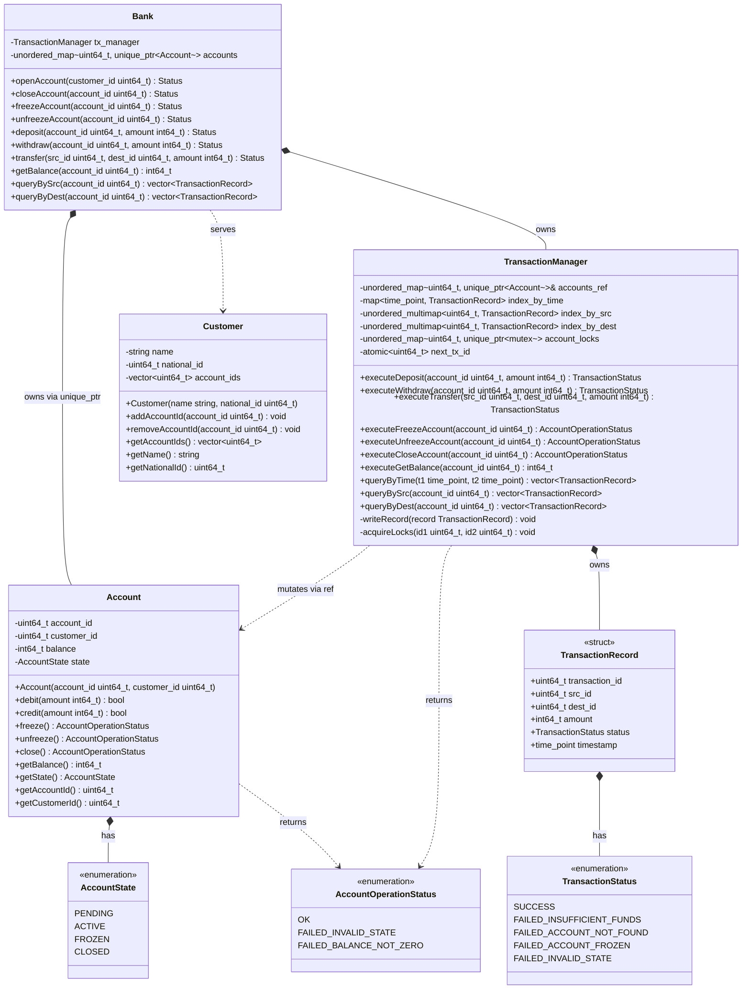
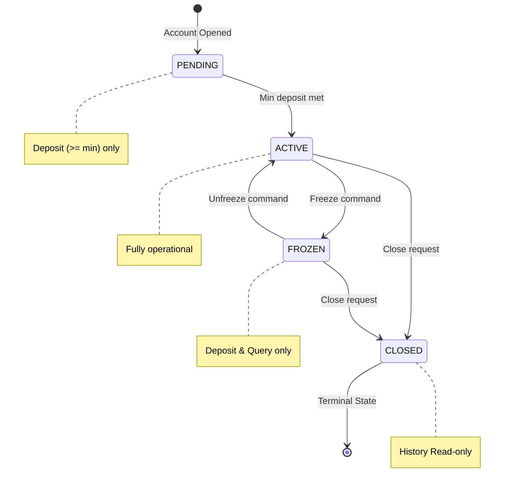
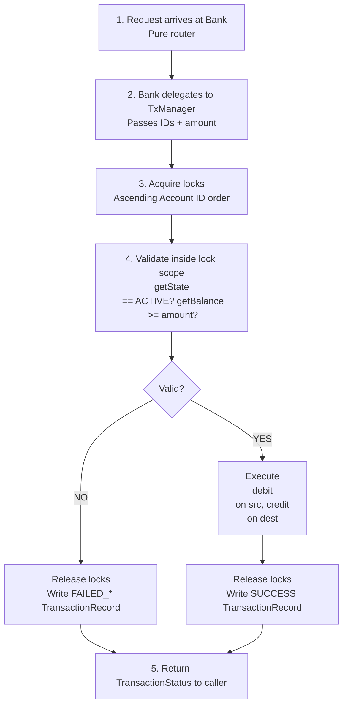

# Banking System

A banking system built with C++.
This project implements strict concurrency controls, per-account locking, and a centralized transaction control to guarantee processing without data corruption.

## System Architecture

The `Bank` acts as a public router, while the `TransactionManager` is responsible for the logic.

### Full UML Class Diagram

---

## Lifecycle & Flow

### Account State Machine

Accounts strictly follow this lifecycle.

### The Transfer Call Chain

## STRICT RULES

1. **Deadlock Prevention (Lock Ordering):** In any multi-account operation, mutexes are **always** acquired in ascending `uint64_t` Account ID order. No exceptions.
2. **Atomic Validation:** Validation always occurs *inside* the lock scope, never before acquiring the lock.
3. **Single Source of Truth:** `TransactionHistory` is an internal container inside `TransactionManager`, not a separate entity.
4. **Separation of Concerns:** `Bank` performs zero business logic. It routes and owns. Only `TransactionManager` mutates `Account` state.
5. **Memory Safety:** `Customer` objects hold Account IDs only. No raw pointers or smart pointers to `Account` objects.
6. **Audit Integrity:** Failed transactions produce exactly one `FAILED_*` `TransactionRecord`. No partial records. No silent failures.
7. **Thread-Safe IDs:** Transaction IDs are unique `uint64_t` values generated with `std::atomic<uint64_t>`.
