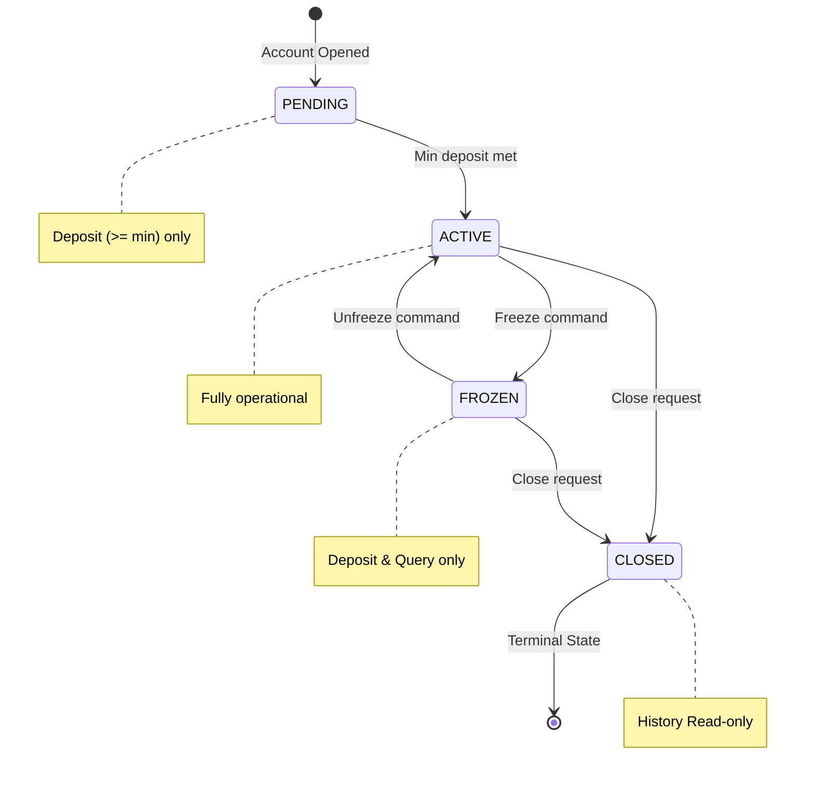
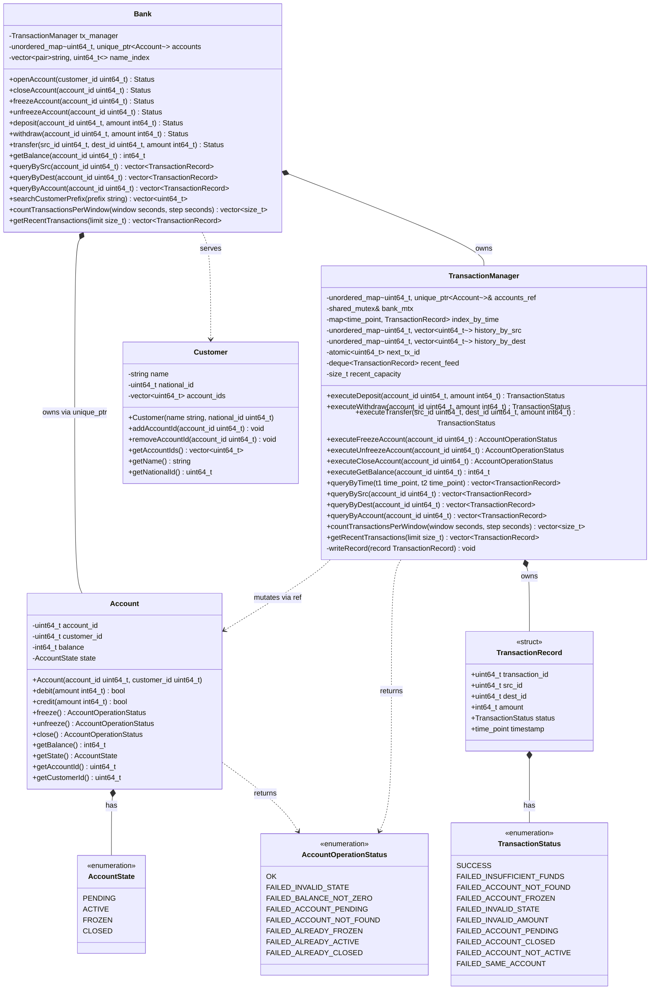
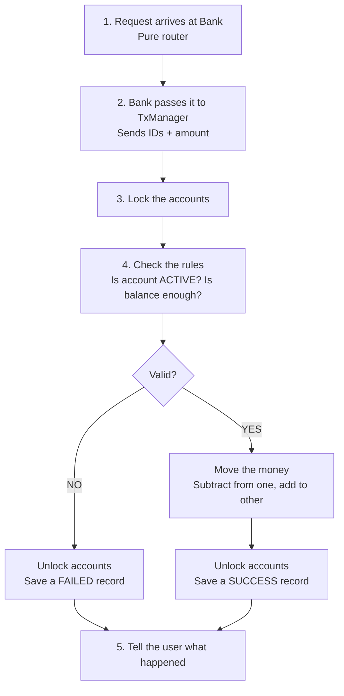

# Banking System

A banking system built in C++20 that focuses on choosing the right data structures to store, search, and manage financial data efficiently. The project applies hash maps, multimaps, deques, and binary search to solve real banking problems while maintaining a clean system design.

---

## Group Members and IDs

| Name | ID |
|------|----|
|Mossad ElMahgob | 2300568 |
|Lana Mohamed |2300693 |
|Malak Ashraf |2300619 |
|Nouran Hesham |2300556 |
|Kareem Hany | 2300353 |

---

## Short Project Description

This project is a banking system we built for our Data Structures and Algorithms course. The main goal was to figure out how to store and retrieve banking data, accounts, customers, and transaction histories, as efficiently as possible.

Instead of putting everything in one big list and searching through it every time, we split our data across several specialized data structures. We use hash maps (`std::unordered_map`) for instant O(1) lookups by ID, a sorted multimap for time-based range queries in O(log n), and a deque for a sliding window of recent transactions. Each data structure was picked because it matched what a specific operation needed, fast point lookups, ordered range scans, or constant-time inserts at both ends.

On the design side, we separated the system into two main parts: the `Bank` class, which owns all the data and acts as a simple router, and the `TransactionManager` class, which handles all the logic and rules. Accounts follow a strict state machine (`PENDING` → `ACTIVE` → `FROZEN` → `CLOSED`), and every operation — even failed ones — gets recorded so nothing is lost. We also added basic locking around our data structures so they stay consistent if the program ever runs in a multi-threaded environment.

A Qt6 graphical interface is included so users can interact with the system through a login screen, admin dashboard, and customer dashboard.

---

## Selected Data Structures and Rationale

| Data Structure | Where We Use It | What It Does | Why We Picked It |
|---|---|---|---|
| `std::unordered_map<uint64_t, unique_ptr<Account>>` | `Bank`, `TransactionManager` | Main storage for all accounts | **O(1) average lookup** by account ID. When we need an account, we get it instantly instead of searching a list. `unique_ptr` cleans up memory automatically. |
| `std::unordered_map<uint64_t, unique_ptr<Customer>>` | `Bank` | Customer registry | **O(1) lookup** by customer ID. A customer can have multiple accounts, and we find them right away. |
| `std::unordered_map<uint64_t, uint64_t>` | `Bank` (`national_id_to_customer`) | Maps National ID → Customer ID | **O(1) duplicate check** during registration. Also used for fast login — we type in a National ID and find the customer immediately. |
| `std::unordered_map<uint64_t, TransactionRecord>` | `TransactionManager` | Stores every transaction by its ID | **O(1) lookup** for any specific transaction. If we know the ID, we get the full record instantly. |
| `std::unordered_map<uint64_t, vector<uint64_t>>` | `TransactionManager` (`history_by_src`, `history_by_dest`) | Indexes which transactions belong to which account | **O(1) to find the index**, then **O(k)** to collect k results. This avoids scanning every transaction in the bank just to find one account's history. |
| `std::multimap<time_point, uint64_t>` | `TransactionManager` (`index_by_time`) | Keeps transactions sorted by timestamp | Auto-sorts by time. We use `lower_bound` / `upper_bound` for **O(log n + k)** range queries — find all transactions between two dates without sorting anything manually. |
| `std::deque<TransactionRecord>` | `TransactionManager` (`recent_feed`) | Holds the most recent transactions | **O(1) push_front and pop_back**. We add new ones to the front and drop old ones from the back. No sorting, no shifting — it just works as a sliding window. |
| `std::vector<pair<string, uint64_t>>` | `Bank` (`name_index`) | Sorted list for customer name search | We keep this sorted lazily and use **binary search (O(log n + k))** for prefix matching. When someone types "Ali", we instantly find "Alice" and "Alicia". |
| `std::shared_mutex` | `Bank`, `TransactionManager` | Protects shared data structures | Allows many people to read at the same time, but only one person writes. We use it to keep our hash maps and indexes safe. |
| `std::mutex` | `Account` | Per-account protection | We lock individual accounts instead of the whole bank. This keeps the rest of the data structures available while one account is being updated. |
| `std::atomic<uint64_t>` | `Bank`, `TransactionManager` | Generates unique IDs | A simple counter that goes up by one each time. It safely produces account IDs, customer IDs, and transaction IDs without collisions. |

---

## System Architecture & Design

### Separation of Concerns: Bank vs. TransactionManager

The system is split into two main classes on purpose:

- **`Bank`** — Owns all the data (accounts, customers) and acts as a **router**. When someone calls `deposit()` or `transfer()`, the Bank simply passes the request to the TransactionManager. It does no calculations and enforces no rules.
- **`TransactionManager`** — Holds all the business logic. It is the **only** part of the code allowed to change account balances, write transaction records, or check if an account is in the right state.

This split means the data storage and the business rules are completely separate. If we ever need to change how a transfer works, we only touch the TransactionManager — the Bank class stays the same.

### The Account State Machine

Every account follows a strict lifecycle. An account cannot skip steps or go backwards randomly:



- **PENDING** — A fresh account. The only thing you can do is deposit at least 500 to activate it.
- **ACTIVE** — The account works normally. You can deposit, withdraw, and transfer.
- **FROZEN** — An admin froze the account. You can only deposit money or check history.
- **CLOSED** — The account is permanently closed. Only the history is still readable.

### Full UML Class Diagram

This diagram shows all the classes, their data, and how they connect to each other:



### The Transfer Flow

This flowchart shows exactly what happens step-by-step when someone transfers money:



### Key Design Decisions

1. **Single Source of Truth:** All transaction history lives inside `TransactionManager`. Even if an account is closed, the history is not lost.
2. **Bank Does No Math:** The `Bank` class only stores data and routes calls. It never touches balances or decides if a transfer is valid.
3. **No Silent Failures:** Every operation — even failed ones — produces a `TransactionRecord`. If a transfer fails because of insufficient funds, that failure is still logged.
4. **Lock Ordering for Safety:** When a transfer touches two accounts, the scoped_lock uses a deadlock avoidance algorithm to ensure safety.
5. **Memory Safety Through IDs:** `Customer` objects store account IDs (numbers), not pointers to account objects. This avoids dangling references if an account is removed.

---

## Implemented Features

### Core Banking Operations

- **Customer Registration** — Registers a customer by name and National ID. Uses a hash map for O(1) duplicate detection so no two customers share the same National ID.
- **Account Opening** — Creates a new account in the `PENDING` state, linked to a registered customer.
- **Account Lifecycle** — Accounts follow a strict state machine: `PENDING` → `ACTIVE` (after depositing at least 500) → `FROZEN` → `CLOSED`. Transitions that don't follow this order are rejected.
- **Deposits & Withdrawals** — Checks the account state and balance before moving any money. The validation happens inside a lock so the data stays consistent.
- **Inter-Account Transfers** — Moves money between two accounts. Locks both accounts (smaller ID first) to protect the data, then validates and executes. The total money in the system never changes — it only moves.
- **Account Freeze / Unfreeze** — An admin can freeze an account (only deposits allowed) or unfreeze it to return to normal.
- **Account Closure** — An account can only be closed if its balance is exactly zero. The transaction history is kept permanently even after closure.

### Querying and Search

- **Transaction History by Source** — Uses the `history_by_src` hash map to find all transactions where an account was the sender. O(1) index lookup, O(k) to collect results.
- **Transaction History by Destination** — Same idea, but for the receiving side using `history_by_dest`.
- **Transaction History by Account** — Combines source and destination results, sorted by timestamp.
- **Time-Range Search** — Uses the `std::multimap` time index with `lower_bound` / `upper_bound` to find all transactions between two dates in O(log n + k).
- **Recent Transaction Feed** — Returns the N most recent transactions from the deque, newest first.
- **Sliding Window Counts** — Counts how many transactions happened in each time window (e.g., per hour) for analytics.
- **Customer Name Prefix Search** — Binary search over a sorted name index. Typing "Ali" instantly finds "Alice" and "Alicia" in O(log n + k).

### User Interface (Qt6)

- **Login Screen** — Enter a National ID to log in. The system checks the hash map and routes to the right dashboard.
- **Admin Dashboard** — View all accounts, freeze/unfreeze/close accounts, and browse the full audit log.
- **Customer Dashboard** — Check balance, view transaction history, deposit, withdraw, and transfer money.
- **Background Worker** — The UI runs smoothly because backend work happens on a separate worker thread.

---

## Compilation and Execution Instructions

### What You Need

- **Compiler:** GCC 10+ or Clang 12+ (C++20 support required)
- **CMake:** Version 3.15 or newer
- **Qt6:** The Qt6 development libraries (specifically the `Widgets` module)
- **Threading:** POSIX threads — CMake links this automatically

### Build and Run

```bash
# Get the code
git clone <repository-url>
cd BankingSystem

# Set up the build
cmake -B build -S . -DCMAKE_BUILD_TYPE=Release

# Compile
cmake --build build -j

# Run the application
./build/BankingSystemQt
```

---

## AI Usage Declaration

During this project, we used AI tools (large language models) to help in the following areas:

- **Data Structure Validation:** We asked the AI to confirm that our choices (`std::unordered_map` for lookups, `std::multimap` for time indexing, `std::deque` for recent feeds) were the right fit for each operation's time complexity needs. It confirmed our selections and suggested alternatives where applicable.
- **Debugging:** We used AI to help track down bugs related to data structure misuse and edge cases in the account state machine.
- **UI Scaffolding:** AI helped us write the starting boilerplate code for the Qt6 interface and figure out how to connect buttons and forms to our C++ backend.

All data structure selection, algorithm design, business logic, and system architecture decisions were made and reviewed by our team.
